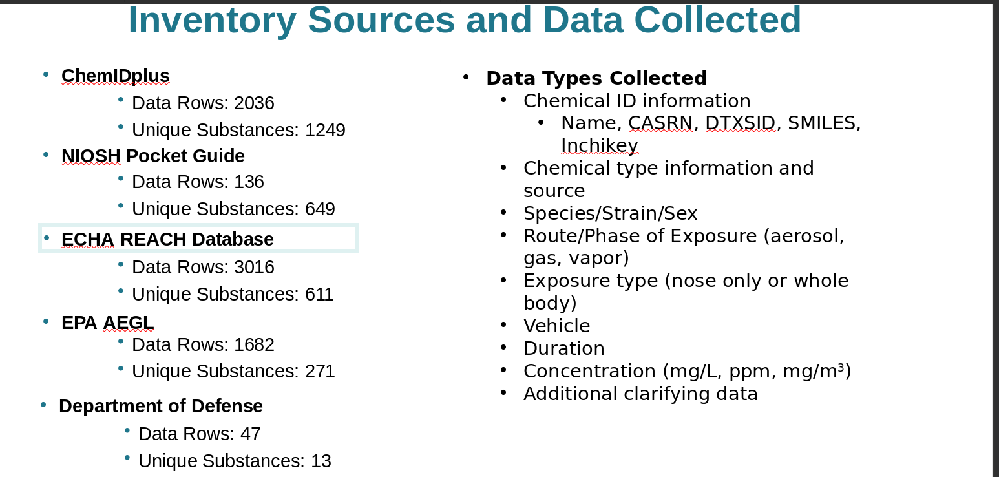

# compait

## 🔍 Overview
CoMPAIT (Collaborative Modeling Project for Acute Inhalation Toxicity) is a harmonized dataset of acute inhalation toxicity studies.  It contains curated LC50 data (in mg/L and ppm), exposure phase (gas, vapor, aerosol), chemical identifiers (SMILES, DTXSID, CASRN),  and hazard categories across multiple regulatory frameworks (e.g. GHS, EPA OPPT, EPA OPP, CPSC, DoT). The dataset supports development  and evaluation of in silico models for inhalation toxicity and regulatory classification.


## 📦 Data Source

- **NICEATM CoMPAIT Consortium**  
  URL: [https://ntp.niehs.nih.gov/go/iccvam](https://ntp.niehs.nih.gov/go/iccvam)
  <br>Citation: Kleinstreuer et al. (2018) Comp Tox; Strickland et al. (2023); Karmaus et al. (2022)
  <br>License: CC BY 4.0


## 🔄 Transformations
- Preserved the original CoMPAIT challenge data as released by NICEATM
- Converted raw CSVs to a single Parquet file for efficient access
- No modifications, cleaning, or additional processing was applied


## 📁 Assets

- `compait.parquet` (Parquet): Main harmonized dataset including LC50, exposure phase, chemical IDs, and regulatory categories

- `compait.json` (JSON): Structured version of the dataset for programmatic access and integration with modeling pipelines


## 🧪 Usage
```bash
biobricks install compait

import biobricks as bb
import pandas as pd

paths = bb.assets("compait")
df = pd.read_parquet(paths.compait_parquet)
print(df.head())

## Additional Information

Collaborative Modeling Project for Acute Inhalation Toxicity (CoMPAIT)


